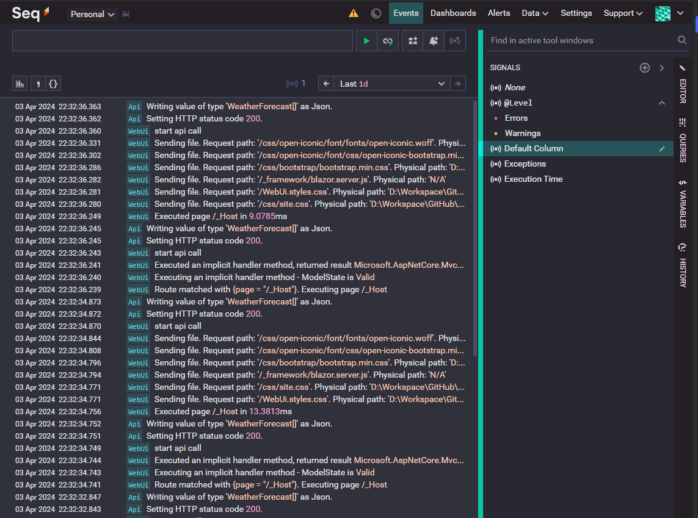
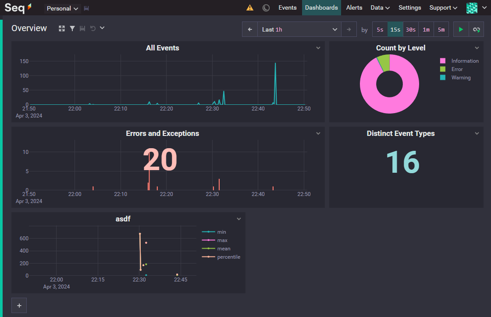

<!-- invert -->
# Centralized Logging with Seq 

## Structured Logging with Serilog & Datalust Seq

---

## About me

### Raphael Kuster

**Software Dev for ~10y** & a lot of random other stuff (festivals, woodworking & 3d print shop ...)

   <!-- fit -->

 **@rfKust**      **BigHoss**      **www.kuster.live**<!-- fit -->

---

# Structured Logging

Structured logging is a logging method where each log entry is formatted as structured data, such as JSON, rather than plain text. This format allows for more efficient querying, analysis, and processing of log data by including key-value pairs that provide context about the event being logged.

<!-- _footer: "Ai Generated" -->

---

## Datalust Seq

[https://datalust.co/seq](https://datalust.co/seq)

<!-- _footer: "Seq" -->

---

### Licensing

<!-- _footer: "Seq" -->

---

## Dashboards

<!-- _footer: "Seq" -->
---

### Alerts and Integrations

#### Notifications

send notifications to telegram, teams, slack

#### Datasources

- send data via api (pwsh, bash)
- technology agnostic (any language, any technology)
- read data from any source (databases, logfiles, ...)

<!-- _footer: "Seq" -->

---

# Demo

---

## Thanks for your attention

The code is on github

[https://github.com/kuster-live/centralizedLogging-Seq](https://github.com/kuster-live/centralizedLogging-Seq)

<!-- _footer: "Backgroundimage by coolvector on Freepik" -->
<!-- link to background image https://www.freepik.com/free-vector/gradient-hexagonal-background_13955213.htm#query=svg%20background&position=3&from_view=keyword&track=ais&uuid=cd1420f3-a9b1-466b-80cd-7712f43308a7 -->
